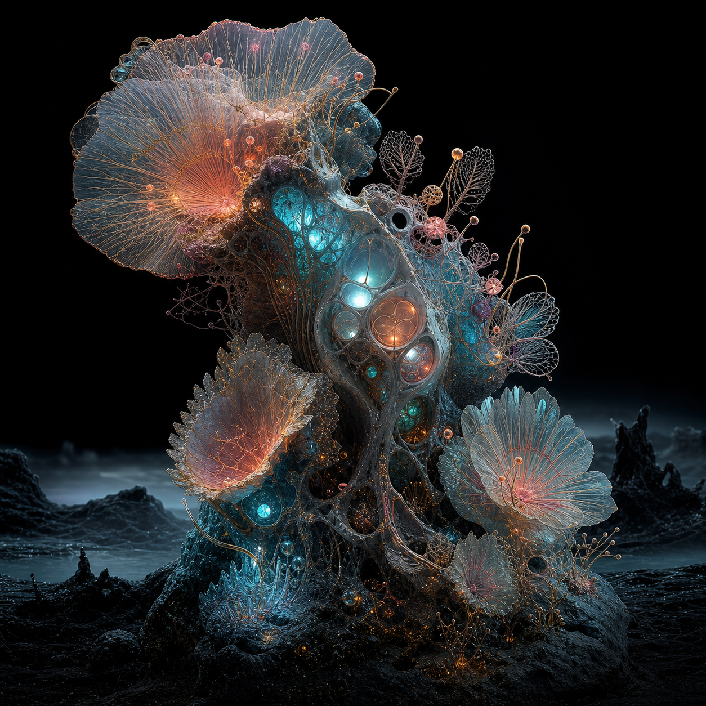
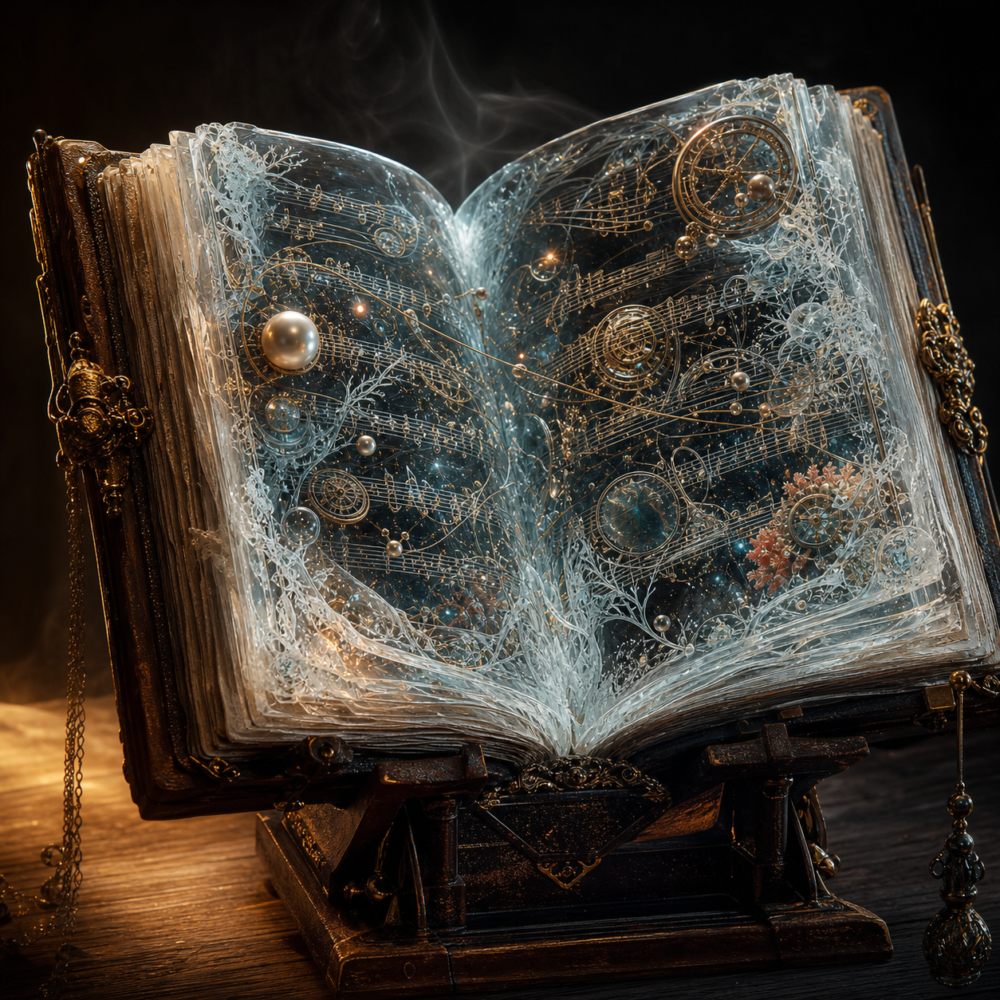
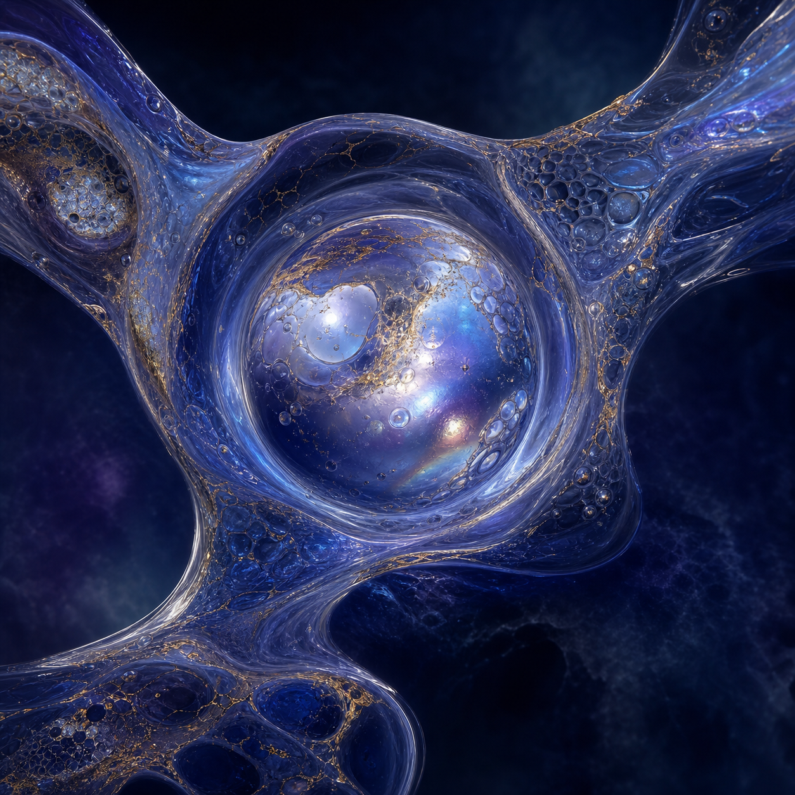
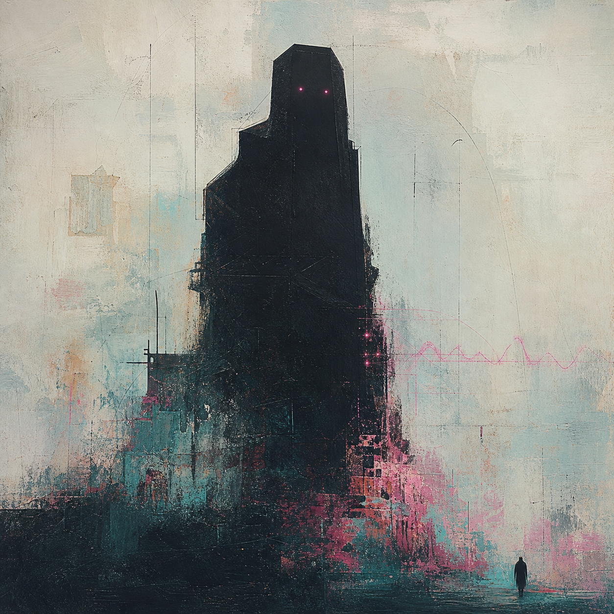
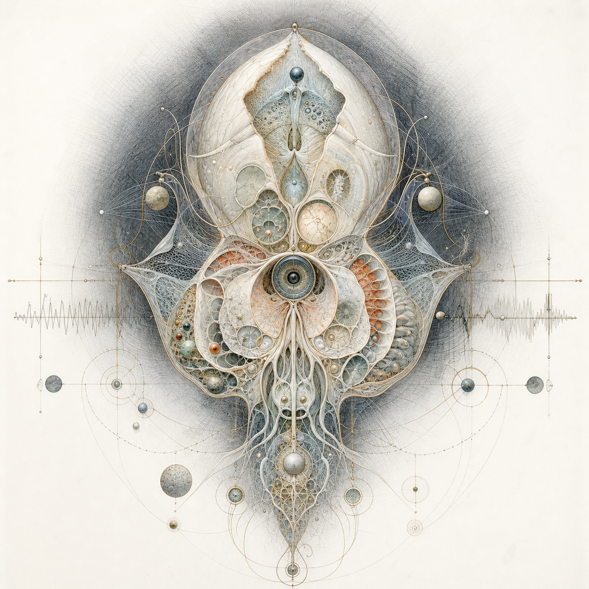
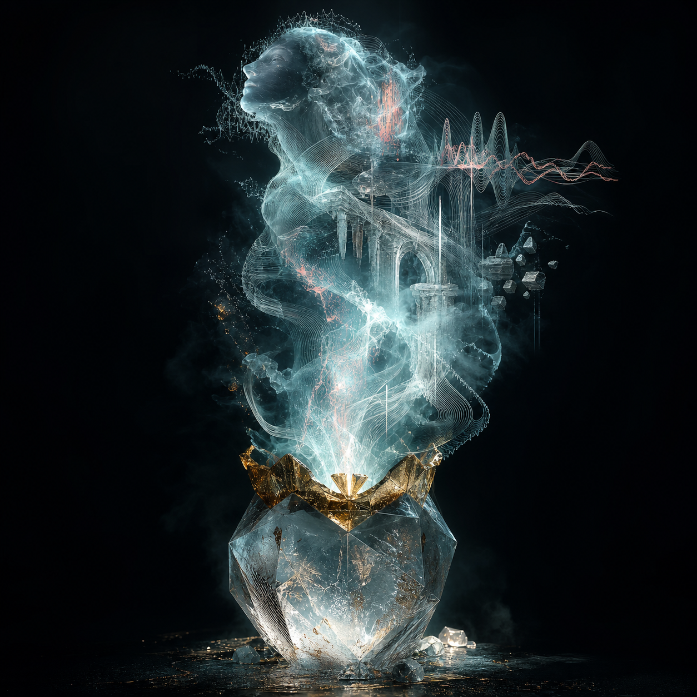

# Impossible Observatory Material Studies

Date: 2026-07-18
Work item: `WI-ART-01-02`
Status: Accepted by Mark as the first material-study checkpoint
Generation mode: Built-in image generation; original prompts; no supplied reference image used as an input asset

## Contact Sheet

| 01 Living ecology | 02 Impossible artifact | 03 Liquid nacre |
| --- | --- | --- |
|  |  |  |
| `R1`, `R4`, `R8` | `R2`, `R5`, `R7` | `R3`, `R5`, `R7` |

| 04 Painterly presence | 05 Diagram organism | 06 Spectral performance |
| --- | --- | --- |
|  |  |  |
| `R6`, `R1`, selective `R9` | `R8`, `R9`, `R4` | `R2`, `R7`, `R9`, selective `R5` |

## Coverage Record

| Reference | Visible translation in this round | Primary study evidence | Next route use |
| --- | --- | --- | --- |
| `R1` | Bioluminescent habitat, filament growth, nested scale, concentrated cyan/coral/amber | `01`, `04` | Home threshold, Museum ecology, historical residue |
| `R2` | Familiar scorebook with impossible crystalline interior; staged luminous artifact | `02`, `06` | About archive, AI doors, LifeInbox evidence |
| `R3` | Nacre lens, blue-violet liquid, bubbles, gold veining, responsive ribbon form | `03` | Dreamlife future instrument and AI contextual doors |
| `R4` | Apertures, recursive chambers, shell anatomy, ivory/black/gold radial focus | `01`, `05` | Museum specimens, Sudoku focus, historical depth |
| `R5` | Receiving vessel logic, suspended inclusions, precious material boundary | `02`, `03`, `06` | LifeInbox Handle and Enter |
| `R6` | Near-black sentinel, concentrated magenta presence, scraped pigment and human trace | `04` | Home threshold, About memory, historical work |
| `R7` | Frost, crystal, vapor, theatrical staging, selective gold | `02`, `06` | LifeInbox transformation and global AI appearance |
| `R8` | Intricate organism diagram, graphite mesh, white-space complexity, luminous anatomy | `01`, `05` | Museum and all flagship Understand states |
| `R9` | Waveform body, architectural apparition, cyan/coral spectral residue | `05`, `06`, restrained `04` | Sudoku Together, relationship resonance, AI transition |

Every `R1` through `R9` family has visible material evidence. This accepts the study round, not a route composition or production asset.

## Selection Notes

- `01` proves the Observatory can feel like a living place rather than a dark UI field.
- `02` provides the strongest bridge between Mark's music, memory, personal artifacts, and impossible interiors.
- `03` is the clearest primary material direction for Dreamlife.
- `04` supplies the human/painterly interruption that prevents the world from becoming sterile CGI.
- `05` proves that a pale, intricate explanatory mode can remain part of the same world.
- `06` provides the clearest causal transformation language for AI, Sudoku resonance, and LifeInbox vapor/condensation.

The Museum keyframe round should combine these laws without placing the six studies themselves into a collage. Each project needs a distinct phenomenon derived from its content.

## Provenance And Use

- These images were generated specifically for this portfolio's visual-development process.
- Mark's supplied images were treated as external taste references and were not used as compositing inputs or copied production assets.
- Preserve these files as keyframe evidence and prompt-direction references.
- Do not ship a study unchanged as a full-page website background.
- Production assets must be recomposed for the exact route, responsive crop, depth transformation, calm state, and performance envelope.
