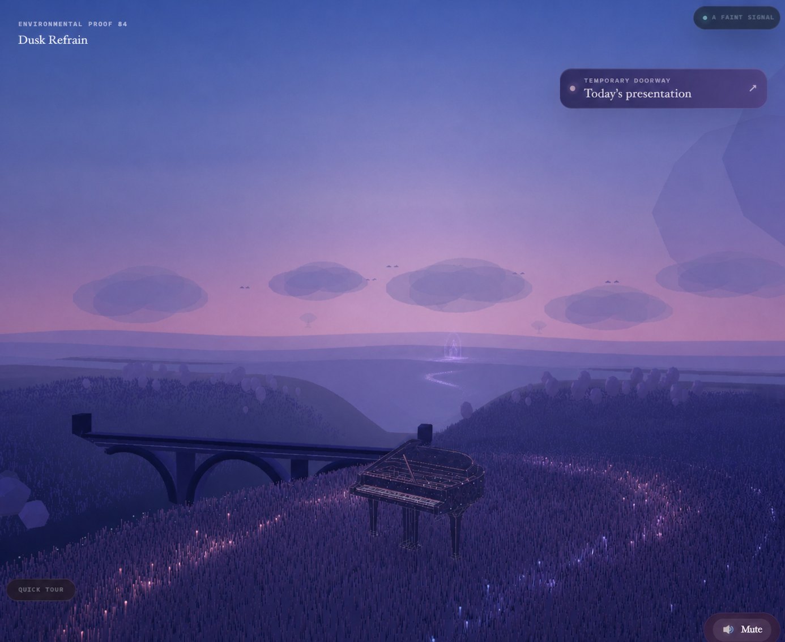

# Music Preview Packet: Quiet Phrase Fields

Status: `in-review`  
Checkpoint: `ART-16E1`  
Review scope: preview influence only, not the selected Resonant Meadow

This is an environmental direction keyframe, not a literal screenshot. The production pianist, practice instruments, navigation, camera, terrain, and dusk palette remain fixed. The earlier clean Home capture is used here so the four environmental changes are easy to judge.

## One Idea

A musical phrase should become visible because the landscape receives and carries it, not because a waveform is drawn over the page.

| Beat | What changes | Timing |
| --- | --- | --- |
| Contact | Pearl piano particles organize into fine local filaments; nearby grass tips answer in a broken phrase | `0-450ms` |
| Travel | Two narrow phrase fields move through the foreground grass with quiet gaps between them | `350-1200ms` |
| Reply | One short silver-violet reflection follows the river downstream after the grass response | `850-1450ms` |
| Horizon | One small translucent acoustic aperture briefly resolves in the distant valley | `1200-1750ms` |

Sustained hover does not restart a beat. Each material keeps its own slow life until attention leaves. Retreat closes the aperture first, then removes the river reply, settles the grass phrases, and finally loosens the piano filaments.

## Build Boundary

| Layer | Implementation | Ownership |
| --- | --- | --- |
| Piano coherence | Extend the existing piano point shader with one local coherence weight | shared Home canvas |
| Grass phrases | Extend the existing grass shader; no added blades or geometry | shared Home canvas |
| River reply | Add delayed phase uniforms to the existing water shader | shared Home canvas |
| Horizon aperture | One low-poly translucent shell, mounted only for Music preview | lazy Music module |
| Timing | One module state machine driven by the existing frame loop | Music runtime host |

Hard preview budget: one canvas, at most `+1` draw call, `0` full-screen passes, `0` added textures, `0` extra animation schedulers, no duplicated grass/water/piano geometry, and less than `1 MB` of new runtime geometry. Reduced motion replaces travel with short local material shifts. WebGL or module failure keeps semantic instrument feedback and returns to the neutral clearing without trapping navigation.

## Review Decision

- `A` Recommended: keep this causal sequence and restrained intensity.
- `B` Quieter: remove the horizon aperture; keep only piano, grass, and river response.
- `C` Stronger: retain the sequence but allow the aperture to remain faintly visible while Music stays focused.

Not included: music notes, equalizer bars, notation, a concert stage, a global recolor, a circular shockwave, project landmarks, routing, or the selected Music world.
