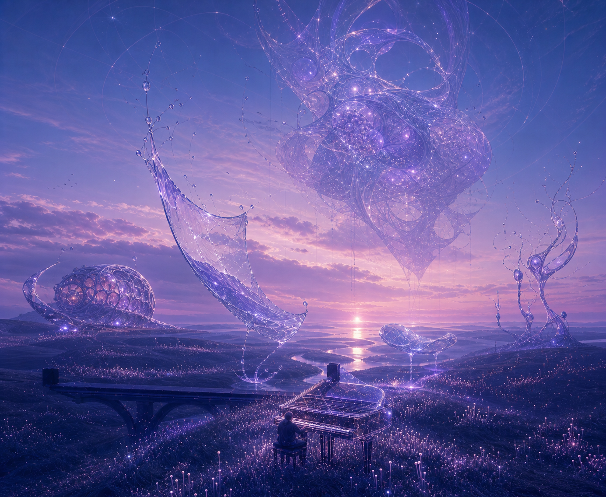

# Resonant Meadow: Rejected Crystal-Organism Draft

Status: `superseded`

Checkpoint: `ART-16E1`

Review scope: historical concept retained to explain what was rejected

Mark rejected this crystal-object direction as more of the same rather than a sufficiently drastic Music world. It is not an active implementation endpoint. [Plan 24](../../implementation-plans/24-Music-Liquid-Landscape-Proof.md) replaces it with the performance-first Liquid Landscape prototype.

This is an environmental direction keyframe, not a literal screenshot. The camera family, valley silhouette, river corridor, bridge, piano coordinate, pianist, dusk palette, and navigation anchors remain continuous with Home.

## World Thesis

Performance changes the physical laws of the valley. Resonance becomes visible as altered gravity, delayed liquid memory, folded terrain, and organisms that hold several moments of the landscape at once.

| Region | Selected-world behavior | Motion character |
| --- | --- | --- |
| Piano gravity well | Pearl piano particles remain readable while nearby grass and light droplets bend into interrupted directional fields; the pianist remains the emotional and About anchor | immediate, precise, human |
| Folded meadow | Portions of terrain peel into translucent topological membranes that retain ghost grass, contour, and moving caustics | responsive, spatial, unsynchronized |
| Liquid memory | The real river keeps flowing while one concave water veil and one downstream liquid lens rise, refract another moment, and return | delayed, legato, downstream |
| Pressure organisms | Unequal nacre-cell, void, wire, mist, and membrane bodies inhabit the slopes without resembling known instruments or buildings | independent, breathing, local |
| Horizon organism | One enormous asymmetrical glass-and-nacre body holds cavities, orbiting particles, and threads that disappear into separate cloud layers | very slow, impossible, dreamlike |
| Sky time field | Long cloud brushstrokes and birds cross faint displaced contour arcs at visibly different temporal offsets | slowest, atmospheric |

The result should feel spacious and alive before pointer input. Attention locally increases coherence, travel, refraction, or response around the nearest material; it never makes the whole world pulse together.

## Depth And Content

The selected world establishes empty authored positions before project/content landmarks are added. Later Music depth may include performances and covers, arrangements and compositions, lessons, sample packs and sound resources, and music-related tools. That content decision remains separate from this environmental gate.

## Runtime Shape

- Reuse one Home canvas, camera, terrain, grass, water, piano, weather, and frame loop.
- Extend existing piano, grass, water, cloud, fog, and light materials rather than duplicating their base geometry.
- Add a lazy Resonant Meadow scene group containing low-poly folded-meadow membranes, two water-response surfaces, instanced local organisms, and one low-poly horizon organism.
- Give piano, grass, river, resonators, and sky independent phase clocks derived from one scheduler.
- Mount selected-only geometry during transition, then dispose it deterministically on retreat or world replacement.
- Reduced motion keeps the transformed materials and stable forms but removes traveling phrases, broad refraction, and large phase changes.

Selected-world target budget: one canvas; no full-screen post-processing; no second scheduler; no duplicate grass, river, piano, or base terrain; at most `+8` draw calls for instanced organisms, terrain membranes, two liquid surfaces, horizon body, and sparse particles; at most `2` small procedural lookup textures if shader math alone is insufficient; less than `4 MB` new compressed geometry and texture data. The neutral clearing remains unchanged and carries none of this selected-only cost. Fidelity is achieved through shaders, transparency, instancing, refraction, and phase variation rather than dense geometry.

## Hover Derivation Rule

The hover overlay is designed only after this world is accepted. It will be a weighted middle state made from the same materials and geometry, not a separate visual concept:

- preserve the complete world's piano gravity response and one nearby phrase field;
- reveal only an early refraction in the ordinary river, before either liquid surface rises;
- show a partial atmospheric displacement from the horizon organism, never its complete body;
- omit folded terrain, project landmarks, and all but one local pressure organism;
- interpolate through the same uniforms and scene group so hover naturally continues into selection.

## Review Decision

- `A` Recommended: retain this drastic altered-physics ecology as the selected Music world.
- `B` More pastoral: keep the impossible systems but reduce the horizon organism and folded-meadow coverage.
- `C` More abstract: preserve the hierarchy while pushing the organisms, liquid memory, and time-field diagrams farther from recognizable natural forms.

Avoid literal notes, notation, equalizers, concert staging, DAW interfaces, giant ribbons, repeated portals, synchronized pulses, or a global recolor as the only transformation.
