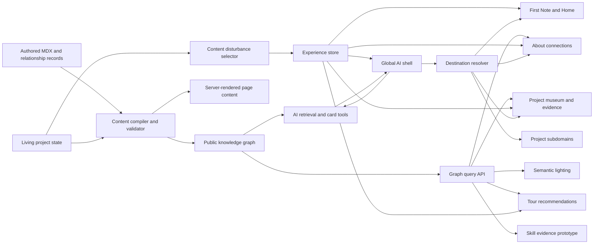

# System Architecture And Interface Contracts

Last updated: 2026-07-13

## Plan Metadata

| Field | Value |
| --- | --- |
| Plan ID | `ARC` |
| Status | Active foundation |
| Upstream | Comprehensive Website Vision, Decision Register |
| Downstream | Every active implementation plan |
| Primary outputs | Stable IDs, shared contracts, ownership boundaries, event vocabulary |
| Execution packages | `ARC-01` through `ARC-05` |

## Purpose

Define how the planned systems connect so that experience, graph, AI, projects, About, living state, and quality work do not invent incompatible models independently.

This document owns cross-system contracts. Workstream documents own internal implementation details.

## System Map



## Runtime Boundaries

### Build-Time And Server Content

Owns:

- MDX parsing.
- Schema validation.
- Graph compilation.
- Visibility filtering.
- Public content queries.
- AI retrieval source resolution.

Must not depend on:

- Browser local storage.
- Three.js objects.
- Current visitor interaction state.

### Client Experience Runtime

Owns:

- Discovery state.
- Tour state.
- Stimulation preferences.
- Current semantic checkpoint.
- Current depth state for mounted experiences.
- Current AI context identifiers.

Must not own:

- Factual content copies.
- Private graph nodes.
- Long-lived server transcripts.
- Raw content parsing.

### Project Experience Modules

Own:

- Project-specific interaction logic.
- Local demonstration state.
- Project-specific exploded visuals.
- Mapping product actions to shared depth and AI context events.

Must use shared contracts for:

- Stable IDs.
- Depth stages.
- Destinations.
- Discovery events.
- Evidence references.
- Error and loading states.

## Canonical Identifier Contract

All systems use namespaced stable IDs.

```ts
type NodeId = `${NodeNamespace}:${string}`;
type DestinationId = `destination:${string}`;
type ExperienceId = `experience:${string}`;
type DiscoveryId = `discovery:${string}`;
type RelationshipId = `relationship:${string}`;
type ContentVersion = `${number}-${number}-${number}:${string}`;
```

Examples:

- `project:lifeinbox`
- `timeline:2016-discord-server-growth`
- `experience:lifeinbox-entry-autopsy`
- `destination:project-lifeinbox-understand`
- `discovery:lifeinbox-expiry-safeguard`

Rules:

- Display labels can change without changing IDs.
- IDs are lowercase ASCII and kebab-case after the namespace.
- IDs are never derived from array position.
- Published IDs require migrations before removal or replacement.
- Client-provided IDs are always resolved and validated server-side.

## Shared Depth Contract

```ts
type DepthStage = 'signal' | 'approach' | 'handle' | 'enter' | 'understand';

interface DepthState {
  destinationId: DestinationId;
  stage: DepthStage;
  selectedPartId?: string;
  safeState?: Record<string, string | number | boolean>;
}
```

Rules:

- Workstreams may omit unsupported stages but cannot rename them.
- `safeState` must be serializable, bounded, and non-sensitive.
- Deep links default to a stable stage, usually Approach or Enter.
- Understand requires evidence or authored explanation, not merely a larger animation.

## Destination Contract

```ts
interface ExperienceDestination {
  id: DestinationId;
  href: string;
  nodeId?: NodeId;
  areaId?: string;
  experienceId?: ExperienceId;
  requestedDepth?: DepthStage;
  safeState?: Record<string, string>;
}
```

Owned by: Architecture registry.

Consumed by:

- Guided tour.
- AI archive cards.
- Knowledge relationships.
- Deep links.
- Returning checkpoints.
- Future shared state links.

Every destination must provide:

- Validation.
- A safe fallback route.
- A checkpoint restoration policy.
- Cross-subdomain behavior.

## Discovery Event Contract

```ts
type DiscoveryEventType =
  | 'signaled'
  | 'approached'
  | 'handled'
  | 'entered'
  | 'understood'
  | 'easter_egg_found'
  | 'meaningful_update_seen';

interface DiscoveryEvent {
  id: string;
  type: DiscoveryEventType;
  discoveryId: DiscoveryId;
  destinationId: DestinationId;
  occurredAt: string;
  contentVersion?: ContentVersion;
}
```

Consumers:

- Local persistence.
- Tour hint suppression.
- Disturbance resolution.
- Skill evidence prototype.
- Optional privacy-respecting analytics.

Do not use discovery events as factual evidence in the knowledge graph.

## AI Context Contract

```ts
interface PortfolioAIContext {
  route: string;
  destinationId?: DestinationId;
  nodeId?: NodeId;
  experienceId?: ExperienceId;
  depthStage?: DepthStage;
  selectedRelationshipId?: RelationshipId;
}
```

The client sends identifiers only. The server resolves public content, related nodes, and evidence.

The AI contract depends on:

- Validated graph.
- Destination registry.
- Current depth state.

The AI must not consume raw scene state or unrestricted local discovery history.

## Archive Card Contract

```ts
interface ArchiveCard {
  id: string;
  type: 'project' | 'timeline' | 'post' | 'architecture' | 'experience' | 'skill' | 'offering';
  title: string;
  summary: string;
  sourceNodeIds: NodeId[];
  destinationId: DestinationId;
  visualKey?: string;
}
```

Producer: AI server tools or reviewed local suggestions.

Validator: Destination and graph registries.

Consumer: Global AI shell and transition controller.

## Graph Query Contract

Components must use bounded query functions, not traverse raw graph objects.

```ts
interface GraphQueryOptions {
  visibility: 'public';
  limit: number;
  relationshipTypes?: string[];
  reviewedOnly: true;
}
```

Every visitor-facing graph query must be:

- Public-only.
- Reviewed-only.
- Result-limited.
- Deterministically ordered.
- Explainable.

## Project Experience Contract

```ts
interface ProjectExperienceModule {
  id: ExperienceId;
  projectId: NodeId;
  supportedStages: DepthStage[];
  load: () => Promise<React.ComponentType<ProjectExperienceProps>>;
  getInitialState: () => Record<string, unknown>;
  validateSafeState: (state: unknown) => Record<string, string> | undefined;
  evidenceNodeIds: NodeId[];
}
```

Project experiences emit shared events through callbacks rather than importing global stores directly where avoidable.

## Living-State Contract

Living project state compiles into a graph node and content version.

Consumers:

- Project Approach and Understand layers.
- AI retrieval.
- New-content disturbances.
- Guided tour reason text.

Precedence rule:

Current reviewed project state overrides older descriptive content when they conflict about present behavior.

## Semantic-Lighting Contract

Semantic lighting receives reviewed relationships transformed into render-safe edges.

It does not query content files directly.

```ts
interface SemanticEdgeView {
  relationshipId: RelationshipId;
  sourceDestinationId: DestinationId;
  targetDestinationId: DestinationId;
  explanation: string;
  strength: 'primary' | 'secondary';
}
```

## Cross-System Events

| Event | Producer | Consumers | Required payload |
| --- | --- | --- | --- |
| `depth.changed` | Depth controller | Persistence, AI context, tour | Destination, stage |
| `destination.requested` | Tour or AI card | Transition controller | Destination ID |
| `relationship.selected` | About, museum, AI | Lighting, AI context | Relationship ID |
| `project_state.updated` | Content build | Disturbance compiler, AI | Project ID, version |
| `discovery.recorded` | Experience store | Persistence, optional analytics | Discovery event |
| `stimulation.changed` | Visitor control | 3D, audio, motion | Normalized value |
| `experience.failed` | Experience boundary | Fallback UI, observability | Experience ID, code |

Prefer typed local functions or state actions over a global browser event bus. The table defines semantics, not a required technical transport.

## Dependency Matrix

| System | Requires | Provides |
| --- | --- | --- |
| Experience foundation | IDs, destination contract | Depth, discovery, tour, stimulation |
| Knowledge graph | IDs, content schemas | Reviewed nodes, edges, queries |
| Global AI | Graph queries, destinations, depth context | Answers, sources, archive cards |
| Project museum | Experience foundation, graph, project state | Exhibits, demos, evidence context |
| About depth | Experience foundation, graph | Event consequences, memory prototype |
| Living project state | Content schema, graph IDs | Current truth, content versions |
| Semantic lighting | Graph query, destinations | Relationship signals |
| Skill prototype | Graph evidence, discovery events | Capability view |
| Quality and rollout | All contracts | Validation, flags, release evidence |

## Contract Change Process

1. Record the proposed decision in `11-Decision-Register.md`.
2. Identify affected work packages in `12-Traceability-Matrix.md`.
3. Update this contract document first.
4. Add migration or compatibility behavior.
5. Update owning workstream plans.
6. Validate compile-time and runtime consumers.

## Completion Criteria

- Stable ID and destination registries are implemented and validated.
- Depth, AI context, discovery, graph, and experience types share one source.
- Cross-subdomain destination behavior is tested.
- Workstreams do not duplicate canonical contracts.
- Contract changes have an explicit migration path.
