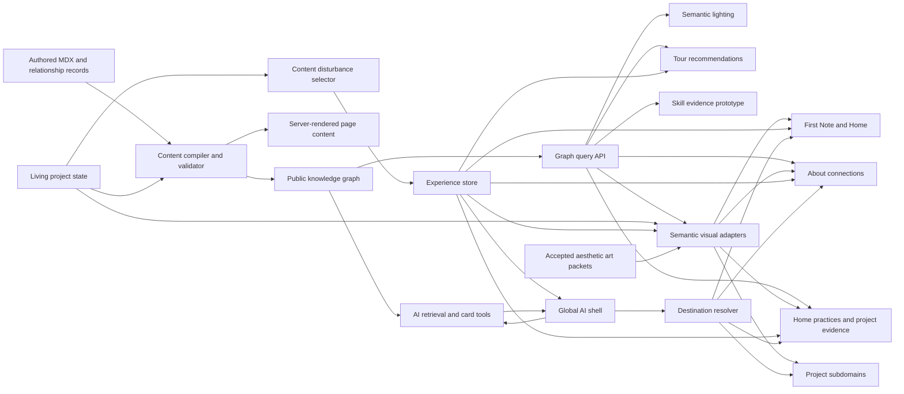

# System Architecture And Interface Contracts

Last updated: 2026-07-24

## Plan Metadata

| Field | Value |
| --- | --- |
| Plan ID | `ARC` |
| Status | Active foundation |
| Upstream | Comprehensive Website Vision, Decision Register, Information Architecture And Routing Decision, selected art direction |
| Downstream | Every active implementation plan |
| Primary outputs | Stable IDs, shared contracts, ownership boundaries, event vocabulary |
| Execution packages | `ARC-01` through `ARC-06` |
| Capability tracking | `CAP-ARC-*` in [Capability Ledger](15-Capability-Coverage-Ledger.md) |

## Purpose

Define how the planned systems connect so that experience, graph, AI, projects, About, living state, and quality work do not invent incompatible models independently.

This document owns cross-system contracts. Workstream documents own internal implementation details.

## Route, Destination, And State Layers

The application is multi-route and one experiential world.

Use four distinct layers:

| Layer | Owns | Examples |
| --- | --- | --- |
| Durable route | Independent loading, direct access, search/canonical metadata, and error boundary | `/`, `/about`, `/work/[practice]`, `/projects/[slug]`, project subdomains, blog posts |
| Semantic destination | Stable selected place and requested depth within or across routes | A timeline event, project exhibit, product experience, architecture layer |
| Shareable safe state | Bounded validated state needed to restore a useful view | Selected part, authored scenario key, requested depth |
| Transient interaction | Pointer, camera, animation, drag, local puzzle edit, and unreviewed scene state | Never treated as canonical navigation |

The destination resolver maps IDs to routes, selected areas, safe state, fallback, checkpoint policy, and cross-subdomain behavior. Tour, AI cards, graph relationships, semantic lighting, returning checkpoints, and ordinary deep links must use that resolver rather than inventing local URL formats.

Browser Back closes the current meaningful depth state before leaving the durable route. Direct links restore at a safe checkpoint and never launch an unskippable animation.

See [Homepage Practice World And Routing Decision](2026-07-24-Homepage-Practice-World-And-Routing-Decision.md) for the active Home/work structure and `2026-07-16-Information-Architecture-And-Routing-Decision.md` for the retained route/state foundation.

## Home World Ownership

The Home practice world adds three distinct state layers:

| Layer | Owner | Persistence |
| --- | --- | --- |
| Practice taxonomy | Authored content and graph compiler | Build-time, stable IDs |
| Semantic attention | Pure Home-world reducer | Selected practice may persist; raw weights do not |
| Rendered composition | Home compositor and territory dialects | Reconstructed from semantic state |

`/` is the canonical spatial work index. `destination:practice-*` identifies durable selected-practice states, while transient territory weights stay local. `destination:projects` remains a stable compatibility alias during migration.

The shared compositor may normalize attention weights, hysteresis, lifecycle, visibility, capability, and stable frames. Territory implementations own their anchor, atmosphere, material behavior, project metaphor, and selected-state choreography.

At most one territory is dominant at a stable moment. Lightweight anchors remain mounted; expensive territory runtimes are visibility and dominance bounded. No contract may require mounting every proof renderer simultaneously.

## System Map



## Runtime Boundaries

### Build-Time And Server Content

Owns:

- MDX parsing.
- Schema validation.
- Graph compilation.
- Visibility filtering.
- Public content queries.
- AI retrieval source resolution.

Must not depend on:

- Browser local storage.
- Three.js objects.
- Current visitor interaction state.

### Client Experience Runtime

Owns:

- Discovery state.
- Tour state.
- Stimulation preferences.
- Current semantic checkpoint.
- Current depth state for mounted experiences.
- Current AI context identifiers.

Must not own:

- Factual content copies.
- Private graph nodes.
- Long-lived server transcripts.
- Raw content parsing.

### Project Experience Modules

Own:

- Project-specific interaction logic.
- Local demonstration state.
- Project-specific exploded visuals.
- Mapping product actions to shared depth and AI context events.

Must use shared contracts for:

- Stable IDs.
- Depth stages.
- Destinations.
- Discovery events.
- Evidence references.
- Error and loading states.

`PRJ-01` implementation checkpoint:

- `src/lib/museum/types.ts` owns the serializable exhibit definition and view contracts.
- `src/lib/museum/registry.ts` derives all nine exhibits from canonical project content and destinations; it does not duplicate project copy.
- `src/lib/museum/experienceLoaders.ts` owns lazy manifest loading and fails closed on missing, rejected, malformed, wrong-project, or over-claimed-stage modules.
- `src/lib/museum/loadExhibits.ts` is the server boundary for public graph-backed exhibit views.
- `src/components/museum/MuseumFallbackShell.tsx` preserves useful semantic HTML and canonical links when richer systems are unavailable.

The current `ProjectsClient` remains legacy presentation and rollback orchestration. New modules must not import its wheel, audio, modal, or eager-3D assumptions into the shared contract.

### Aesthetic Runtime Boundary

The selected art direction is integrated through the six-layer model in `19-Aesthetic-System-Integration-And-Delivery.md`.

The runtime may consume:

- Stable destination, depth, and selected-part state.
- Render-safe reviewed relationship views.
- Reviewed lifecycle/current-state cues.
- Discovery and stimulation state.
- An accepted surface art packet translated into owned implementation values.

It must not consume:

- Raw MDX or unrestricted graph traversal.
- Runtime-generated factual claims.
- Graph records containing layout coordinates, component names, palettes, or animation curves.
- One universal visual configuration that erases project-specific composition.

Shared aesthetic code owns semantic roles such as emitter, lens, trace, membrane, paper record, calm profile, utility hierarchy, and stable-frame behavior. Owning feature modules retain focal artifact, silhouette, composition, dominant manipulation, and deep-state transformation.

The implemented raster compositions remain valid keyframe checksums, loading posters, reduced-motion states, and fallbacks. In the standard experience they are anchor mattes only: a dominant unchanged raster must not remain the perceived scene while small overlays move above it. Dynamic scenes decompose focal forms, atmosphere, illumination, occlusion, flow, and foreground material into independently addressable authored layers. Shared code may normalize pointer/focus, depth, selection, relationship, AI, discovery, stimulation, visibility, capability, and elapsed-time inputs, but the owning route maps them to material response through local testable scene state.

Continuous rendering is route-scoped and lifecycle-aware. A route normally owns at most one dominant Canvas/WebGL scheduler, pauses it when hidden, replaced by a stable-frame mode, or outside its visibility contract, and leaves semantic DOM available if the renderer or an asset fails. Normal idle is not a settled pause condition: standard-stimulation scenes retain subtle route-authored ambient life. No raw renderer object, pointer coordinate stream, camera matrix, or frame value enters durable experience persistence.

## Canonical Identifier Contract

All systems use namespaced stable IDs.

```ts
type ContentNodeId =
  | `project:${string}`
  | `timeline:${string}`
  | `misc:${string}`
  | `post:${string}:${string}`;

type GraphOnlyNodeId =
  | `project-state:${string}`
  | `feature:${string}`
  | `decision:${string}`
  | `constraint:${string}`
  | `lesson:${string}`
  | `skill:${string}`
  | `community:${string}`
  | `media:${string}`
  | `repository:${string}`
  | `offering:${string}`;

type NodeId = ContentNodeId | GraphOnlyNodeId;
type DestinationId = `destination:${string}`;
type ExperienceId = `experience:${string}`;
type DiscoveryId = `discovery:${string}`;
type RelationshipId = `relationship:${string}`;
type ContentVersion = `${number}-${number}-${number}:${string}`;
```

Examples:

- `project:lifeinbox`
- `timeline:2016-discord-server-growth`
- `experience:lifeinbox-entry-autopsy`
- `destination:project-lifeinbox-understand`
- `discovery:lifeinbox-expiry-safeguard`

Rules:

- Display labels can change without changing IDs.
- IDs are lowercase ASCII and kebab-case after the namespace.
- IDs are never derived from array position.
- Published IDs require migrations before removal or replacement.
- Client-provided IDs are always resolved and validated server-side.

## Shared Depth Contract

```ts
type DepthStage = 'signal' | 'approach' | 'handle' | 'enter' | 'understand';

interface DepthState {
  destinationId: DestinationId;
  stage: DepthStage;
  selectedPartId?: string;
  safeState?: Record<string, string | number | boolean>;
}
```

Rules:

- Workstreams may omit unsupported stages but cannot rename them.
- `safeState` must be serializable, bounded, and non-sensitive.
- Deep links default to a stable stage, usually Approach or Enter.
- Understand requires evidence or authored explanation, not merely a larger animation.

## Destination Contract

```ts
interface ExperienceDestination {
  id: DestinationId;
  href: string;
  nodeId?: NodeId;
  areaId?: string;
  experienceId?: ExperienceId;
  requestedDepth?: DepthStage;
  safeState?: Record<string, string | number | boolean>;
}
```

Owned by: Architecture registry.

Consumed by:

- Guided tour.
- AI archive cards.
- Knowledge relationships.
- Deep links.
- Returning checkpoints.
- Future shared state links.

Every destination must provide:

- Validation.
- A safe fallback route.
- A checkpoint restoration policy.
- Cross-subdomain behavior.

The initial registry also classifies each destination as canonical, planned, legacy alias, internal-only, or feedback-gated. Only canonical and explicitly approved planned destinations may appear in tours or AI cards.

## Discovery Event Contract

```ts
type DiscoveryEventType =
  | 'signaled'
  | 'approached'
  | 'handled'
  | 'entered'
  | 'understood'
  | 'easter_egg_found'
  | 'meaningful_update_seen';

interface DiscoveryEvent {
  id: string;
  type: DiscoveryEventType;
  discoveryId: DiscoveryId;
  destinationId: DestinationId;
  occurredAt: string;
  contentVersion?: ContentVersion;
}
```

Consumers:

- Local persistence.
- Tour hint suppression.
- Disturbance resolution.
- Skill evidence prototype.
- Optional privacy-respecting analytics.

Do not use discovery events as factual evidence in the knowledge graph.

Implementation note: `WI-ARC-02-02` corrected the first increment by adding `easter_egg_found` and separating strict `ContentNodeId` from reviewed graph-only identities. `ARC-02` and the initial `ARC-03` destination registry are accepted; `ARC-04` is the next consumer through typed cross-system actions.

## Cross-Origin Experience State

`localStorage` is origin-scoped. The apex domain and each project subdomain therefore cannot share one local-storage store.

Near-term ownership is:

- A small non-sensitive cookie scoped to `.marknperera.ca` for approved global preferences such as First Note completion, tour role/dismissal, stimulation, and a coarse return hint.
- Versioned per-origin local storage for detailed discoveries, altered objects, and local project-demo state.
- Validated destination and return context for cross-subdomain navigation.
- Session-only AI conversation where practical.

Do not add authenticated or server-persisted visitor profiles merely to synchronize anonymous exploration. Richer persistence requires a separate privacy decision.

## AI Context Contract

```ts
interface PortfolioAIContext {
  route: string;
  destinationId?: DestinationId;
  nodeId?: NodeId;
  experienceId?: ExperienceId;
  depthStage?: DepthStage;
  selectedRelationshipId?: RelationshipId;
}
```

The client sends identifiers only. The server resolves public content, related nodes, and evidence.

The AI contract depends on:

- Validated graph.
- Destination registry.
- Current depth state.

The AI must not consume raw scene state or unrestricted local discovery history.

## Archive Card Contract

```ts
interface ArchiveCard {
  id: string;
  type: 'project' | 'timeline' | 'post' | 'architecture' | 'experience' | 'skill' | 'offering';
  title: string;
  summary: string;
  sourceNodeIds: NodeId[];
  destinationId: DestinationId;
  visualKey?: string;
}
```

Producer: AI server tools or reviewed local suggestions.

Validator: Destination and graph registries.

Consumer: Global AI shell and transition controller.

## Graph Query Contract

Components must use bounded query functions, not traverse raw graph objects.

```ts
interface GraphQueryOptions {
  visibility: 'public';
  limit: number;
  relationshipTypes?: string[];
  reviewedOnly: true;
}
```

Every visitor-facing graph query must be:

- Public-only.
- Reviewed-only.
- Result-limited.
- Deterministically ordered.
- Explainable.

## Project Experience Contract

```ts
interface ProjectExperienceManifest {
  id: ExperienceId;
  projectId: ContentNodeId;
  supportedStages: DepthStage[];
  evidenceNodeIds: NodeId[];
}

interface ProjectExperienceRuntime<State, SafeState> {
  manifest: ProjectExperienceManifest;
  loadView: () => Promise<React.ComponentType<ProjectExperienceProps<State>>>;
  createInitialState: () => State;
  validateSafeState: (state: unknown) => SafeState | undefined;
}
```

`ProjectExperienceManifest` is implemented and accepted. The interactive runtime is added by `PRJ-02`/`PRJ-04` only after a candidate proves its deterministic local state. Keeping the manifest separate allows the lobby to know identity, evidence, and supported depth without downloading an interaction bundle.

Project experiences emit shared actions through callbacks rather than importing global stores directly where avoidable. Runtime state is divided explicitly:

- **Transient local state:** pointer focus, puzzle edits, draft capture text, animation phase, camera state.
- **Persistable local demo state:** only a bounded validated checkpoint that is safe to restore on the same origin.
- **Shareable safe state:** authored scenario key, selected stable part, and requested depth only.
- **Global state:** destination, depth, AI context, discovery, tour, and stimulation remain owned by shared systems.

An experience may support fewer stages than the universal vocabulary. It must never advertise a stage until its interaction, fallback, and tests exist.

## Living-State Contract

Living project state compiles into a graph node and content version.

Consumers:

- Project Approach and Understand layers.
- AI retrieval.
- New-content disturbances.
- Guided tour reason text.

Precedence rule:

Current reviewed project state overrides older descriptive content when they conflict about present behavior.

The first flagship may consume one reviewed selected-project seed from `LPS-06`. This does not imply that the remaining projects are classified. Portfolio-wide consumers may assume complete classification only after `LPS-02`; three flagship consumers may assume full state coverage only after `LPS-03`.

## Semantic-Lighting Contract

Semantic lighting receives reviewed relationships transformed into render-safe edges.

It does not query content files directly.

```ts
interface SemanticEdgeView {
  relationshipId: RelationshipId;
  sourceDestinationId: DestinationId;
  targetDestinationId: DestinationId;
  explanation: string;
  strength: 'primary' | 'secondary';
}
```

Semantic edges carry meaning, not styling. The owning scene decides whether a primary edge becomes a line, refraction, shadow, notation, spatial pull, or no visible treatment. Rendering every relationship is explicitly invalid.

## Aesthetic Art Packet Boundary

An art packet is a reviewed design-and-implementation input, not a new factual source of truth. Its required fields and delivery lifecycle are defined in `19-Aesthetic-System-Integration-And-Delivery.md`.

If structured runtime data is needed, keep it bounded to implementation semantics:

```ts
interface SurfaceVisualDialect {
  id: string;
  scope: 'portfolio' | 'home' | 'museum' | 'project' | 'about' | 'ai' | 'reading';
  silhouetteKey: string;
  materialRoles: string[];
  dominantGesture: string;
  calmProfile: string;
  fallbackProfile: string;
}
```

This is an architectural seam, not a requirement to create a global config immediately. Add code only when two accepted scenes prove a shared consumer. Composition, exact color, geometry, copy, and asset paths stay in the owning surface.

## Dynamic Scene Boundary

The dynamic-scene contract is deliberately smaller than a scene engine:

```ts
interface SceneDriverSnapshot {
  destinationId: DestinationId;
  depth: DepthStage;
  selectedPartId?: string;
  selectedRelationshipId?: RelationshipId;
  stimulation: number;
  reducedMotion: boolean;
  visibility: 'visible' | 'hidden';
  input: 'pointer' | 'keyboard' | 'coarse' | 'unknown';
}

interface SceneTemporalFrame {
  elapsedMs: number;
  deltaMs: number;
  phaseSeed: number;
  stimulation: number;
  reducedMotion: boolean;
  visibility: 'visible' | 'hidden';
}

interface SceneLifecycle {
  requestStableFrame(reason: 'capture' | 'restore' | 'reduced-motion' | 'fallback'): void;
  pause(reason: 'offscreen' | 'hidden' | 'stable-frame'): void;
  resume(): void;
}
```

The exact implementation may change during `ART-12`; these fields document ownership and persistence boundaries. A single route-owned clock may derive slow independent temporal bands for atmosphere, organic sway, mechanical rotation, directional flow, illumination, and foreground occlusion. Those bands must not collapse into one synchronized sine wave. Route modules own layer manifests, scene reducers, renderer selection, shader uniforms, temporal mapping, local choreography, and dominant gestures. Shared infrastructure may own normalized inputs, visibility, stimulation, capability tiering, context-loss recovery, clock hygiene, and stable-frame signaling only after the Museum ambient proof demonstrates a reusable need.

Material manifests may describe asset role, provenance, dimensions, alpha, renderer intent, ambient and responsive drivers, motion masks/maps, calm behavior, budget, and ordered production stage. They must not contain factual project claims or become a universal layout configuration. Generated transparent plates are production ingredients rather than finished compositions and require an approved route-region map and asset brief before generation, followed by edge, alpha, scaling, lighting, perspective, stack, and loop review before compositor selection. The full production and tracking model lives in `20-Dynamic-Scene-Composition-And-Layered-Materials.md`; the pervasive ambient correction lives in `2026-07-20-Pervasive-Ambient-Worlds-Implementation-Plan.md`.

## Cross-System Events

| Event | Producer | Consumers | Required payload |
| --- | --- | --- | --- |
| `depth.changed` | Depth controller | Persistence, AI context, tour | Destination, stage |
| `destination.requested` | Tour or AI card | Transition controller | Destination ID |
| `relationship.selected` | About, museum, AI | Lighting, AI context | Relationship ID |
| `project_state.updated` | Content build | Disturbance compiler, AI | Project ID, version |
| `discovery.recorded` | Experience store | Persistence, optional analytics | Discovery event |
| `stimulation.changed` | Visitor control | 3D, audio, motion | Normalized value |
| `experience.failed` | Experience boundary | Fallback UI, observability | Experience ID, code |

Prefer typed local functions or state actions over a global browser event bus. The table defines semantics, not a required technical transport.

Implementation note: `WI-ARC-04-01` implements this vocabulary as plain discriminated TypeScript actions with ID-first payloads and focused creators. `WI-ARC-05-01` adds structured runtime validation and versioned semantic-state migration; feature-specific adapters remain in their owning packages.

## Dependency Matrix

| System | Requires | Provides |
| --- | --- | --- |
| Experience foundation | IDs, destination contract | Depth, discovery, tour, stimulation |
| Knowledge graph | IDs, content schemas | Reviewed nodes, edges, queries |
| Global AI | Graph queries, destinations, depth context | Answers, sources, archive cards |
| Project museum | Experience foundation, graph, project state | Exhibits, demos, evidence context |
| About depth | Experience foundation, graph | Event consequences, memory prototype |
| Living project state | Content schema, graph IDs | Current truth, content versions |
| Semantic lighting | Graph query, destinations | Relationship signals |
| Aesthetic integration | Authored truth, experience meaning, selected art packets, stimulation | Composed runtime scenes, material roles, utility hierarchy, calm/fallback intent |
| Dynamic scene composition | Accepted art packets, route meaning, reviewed semantic inputs, authored layer packs | Route-owned responsive materials, stable frames, and safe renderer fallbacks |
| Skill prototype | Graph evidence, discovery events | Capability view |
| Quality and rollout | All contracts | Validation, flags, release evidence |

## Contract Change Process

1. Record the proposed decision in `11-Decision-Register.md`.
2. Identify affected work packages in `12-Traceability-Matrix.md`.
3. Update this contract document first.
4. Add migration or compatibility behavior.
5. Update owning workstream plans.
6. Validate compile-time and runtime consumers.

## Completion Criteria

- Stable ID and destination registries are implemented and validated.
- Depth, AI context, discovery, graph, and experience types share one source.
- Cross-subdomain destination behavior is tested.
- Workstreams do not duplicate canonical contracts.
- Contract changes have an explicit migration path.
